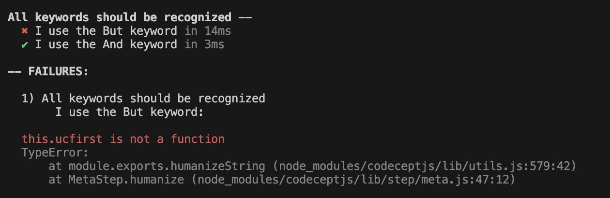

# Demonstration

This repo demonstrates an issue with the installed version of CodeceptJS. When using the `But` keyword in a feature file, the scenario fails and a cryptic error is printed to the console.

